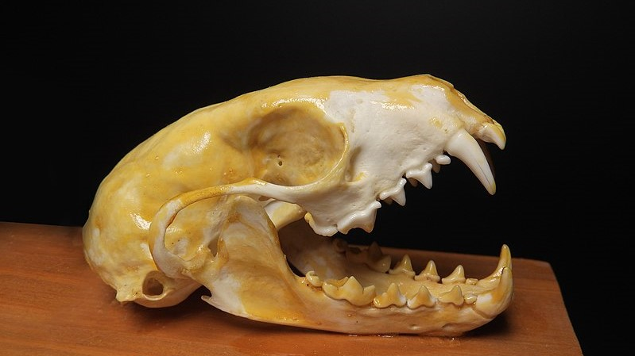

## 0 --- Data
\

This page introduces the data sets you'll be using during the course.  
\

The _**GAMES**_ data will be used during pre-session home-working part of each Chapter, and will be used to help learn theory and skills in data handling, visualisation and analysis.  
\

The _**BIOLOGICAL DATA SETS**_ will be used to apply data theory and skills to real, published biological data sets, during online workshops.  

$~$

### **GAMES DATA**
\ 

#### _The **GAMES** data is a data set you'll use during the home-working part of each Chapter._  
\

The data is based on some simple games/tests and basic information about yourselves. You'll be asked to fill this out during the first lecture for the module. Please look at the information below and fill in the form at the end of this seection. The data is stored anonymously.  

$~$

#### **VARIABLES IN THE GAMES DATA**
\

1. **ROLE**, saved as `role` in the data, is one of:

* _student_ at Lincoln (coded as `student` in the data)
* _staff_ at Lincoln (coded as `staff` in the data)
* _external_ to Lincoln (coded as `external` in the data)
* _child_ (coded as `child` in the data)
* _baby_ (coded as `baby` in the data)

2. **TUTOR GROUP**: your tutor group ID for the module. 
See document on blackboard if you're not sure.
This information will be coded anonymously so that it is not clear which tutor
group is which (makes everything even more anonymous).
Saved as `group` in the data.

3. **EYESIGHT**: your **glasses prescription** (if any). 
If you have a different prescription for 
each eye then take the average.
Saved as `eyesight` in the data.

4. **CONTINENTS**: how many continents you've visited in your life (
including your home continent).
Saved as `continents` in the data.

5. **COUNTRIES**: how many countries you've visited in your life 
(including your home country).
Saved as `countries` in the data-

6. **HEARING**: your score in the hearing test (see below).
Saved as `hearing` in the data.

7. **REACTION** your score in the reaction test (see below). 
Saved as `reaction` in the data.

8. **HARDWARE**, saved as `hardware` in the data, is whether for the two games above, you were using a:

* mouse (coded as `mouse` in the data)
* touchpad or touchscreen (coded as `touch` in the data)  

$~$

##### **HIGH FREQUENCY HEARING TEST**

For the following test you'll need speakers or earphones. Please make sure that the volume is not turned up too loud!  

Once you click, a noise will be produced, starting from 20000Hz and decreasing. You need to click again as soon as you hear the noise. Younger people tend to be able to hear higher frequencies.  

If, for whatever reason, you are unable to take the test, please skip this question.  
\

   <iframe width="360" height="540" src="https://humanbenchmark.com/tests/hearing" frameborder="0" allowfullscreen>
   </iframe>

$~$

##### **REACTION TEST**

This reaction test will measure your reaction time three times; please record the average time in the form. Note: although the test involves clicking when a colour turns from red to green, the test is still suitable for those with any kind of colour blindness as the prompt will change from "Wait for green" to "Click!"  
\

   <iframe width="360" height="540" src="https://humanbenchmark.com/tests/reactiontime/" frameborder="0" allowfullscreen>
   </iframe>

$~$

##### **FORM FOR COMPLETING GAMES DATA**

  <iframe src="https://docs.google.com/forms/d/e/1FAIpQLSevukh74bKwyNouV3g3An5bg0pKV2WeIvI_bLT6nlnSnOD03w/viewform?embedded=true" width="640" height="1138" frameborder="0" marginheight="0" marginwidth="0">Loading…
  </iframe>

\

### **BIOLOGICAL DATA**
\

#### _The **BIOLOGICAL** data consists of data sets that you'll work on in online workshops_.  
\

#### _**EACH GROUP WILL WORK ON ONE OF THE DATA SETS:**_

* **GROUP 1** (timetabled as BM/BV/BCB1, Tuesdays 17:00-18:00): **CELLULAR AGEING**
* **GROUP 2** (timetabled as BM/BV/BCB2, Wednesdays 16:00-17:00): **CELLULAR AGEING**
* **GROUP 3** (timetabled as BM/BV/BCB3, Wednesdays 17:00-18:00): **CELLULAR AGEING**
* **GROUP 4** (timetabled as EQS/Z/BIO, Fridays 16:00-17:00): **URBAN DOGS**
* **GROUP 5** (timetabled as ECL/Z/BIO, Mondays 17:00-18:00): **CARNIVORE LIFE HISTORY**
\

There are three data sets, each focused on different levels of the hierarchy of biological organisation. In the modern age, it is becoming more common to publish scientific research and data "open access", which is essentially a form of creative commons license for science. This usually allows the unrestricted use and redistribution of the work, provided it is cited. All three data sets are freely available online in data archives, and all three research articles are also open-access.  
\

#### **CELLULAR AGEING**

[Huh _et al._ (2016) Maintenance of age in human neurons generated by microRNA-based neuronal conversion of fibroblasts. _eLife_, 5:e18648. DOI: 10.7554/eLife.18648.](https://elifesciences.org/articles/18648)  
\

{width="80%"}

  
\  

When studying old age brain disorders, it is difficult to get samples of the affected cells. New techniques mean it is possible to instead convert fibroblast cells (from the skin) into neurons using an approach termed "microRNA-based cellular reprogramming", but it's important that the converted neurons behave as if they're the same 'age' as their parent fibroblasts . This article measures a number of aspects of cellular age to determine whether or not that is the case.  

The variables are:

* `SampleNo`: the sample number
* `Donor`: the donor ID
* `DNAmAge`: the cell age (measured by applying an epigenetic biomarker to DNA methylation data).
* `Tissue` The tissue type
  + `fibroblasts`, the pre-conversion fibroblast cells
  + `neuron`, the post-conversion medium spiny neuron cells.
* `Age` the age of the donor
* `Gender` the gender identity of the donor
  + `male`
  + `female`
\

The file for this data is called `cell_age_data.csv`.  
\

#### **URBAN DOGS**

[Majumder _et al._ (2016) Denning habits of free-ranging dogs reveal preference for human proximity. _Scientific Reports_, 6:32014. DOI: 10.1038/srep32014.](https://www.nature.com/articles/srep32014)  
\

{width="80%"}

  
\  

In urban settings, it is common for mammals to build their dens away from human activity, but dogs have evolved in the presence of humans. It is unclear then, what governs the choices of den site for feral dogs in urban landscapes versus rural. This study follows 148 dogs in India and scores dens on a number of characteristics to determine whether urban and rural dogs are making similar den choices.  

The variables are:

* `Year`: the year of the study
* `Mother`: the ID of the mother of the litter
* `LitterSize`: the size of the litter 
* `LitterSizeCategory`: the size of the litter as a categorical variable
  + `small`, 1-4 pups
  + `large`, > 4 pups
* `TotalScore`: the total score for den quality across all criteria
* `StructureScore`: the score for den structure (den area, height, level i.e. above or below ground)
* `ResourceScore`: the score for access to resources (distance to food and water)
* `QualityScore`: the score for den quality (shade and light availability)
* `DisturbanceScore`: the level of human disturbances.

(More information on scoring is available in the supplementary material for the article).
\

The file for this data is called `urban_dogs_data.csv`.  
\

#### **CARNIVORE LIFE HISTORY**
\
[Jones _et al._ (2009) PanTHERIA: a species-level database of life history, ecology, and geography of extant and recently extinct mammals. _Ecology_, **90**, 2648. DOI: 10.1890/08-1494.1.](https://esajournals.onlinelibrary.wiley.com/doi/10.1890/08-1494.1)  
\

{width="80%"}

  
\  

The PANTHERIA data base (_pan_ = all-encompassing; _theria_ = the group formed of most extant mammals) is an open-access data base of mammal life history and ecology data. Life history refers to timings of events in an organism's life, such as age at reproductive maturity, reproductive rate, longevity, etc., and ecological data encompasses anything to do with an organism's environment and interactions with other species. Data bases like this one are often used to conduct macro-ecological and macro-evolutionary (and macro-eco-evolutionary) studies; looking at how species and their life forms have evolved according to their lineages and ecologies. This subset of the data is for the carnivores.  

The variables are:

* `Family`: the species' Family, e.g. Felidae (cats), Otariidae (eared seals), Ursidae (bears)...
* `Genus`: the Genus
* `Species`: the Species (binomial)
* `AdultBodyMass`: Average adult body mass in grams
* `BasalMetabolicRate`: basal metabolic rate in millilitres of oxygen per hour
* `LitterSize`: the average litter size
* `LittersPerYear`: the average number of litters per year
* `GestationLength`: the gestation length in days
* `MaxLongevity`: the maximum known longevity in days
* `SexualMaturity`: the average age at sexual maturity in days
* `TrophicLevel`: the trophic level
  + `1`, `2`, or `3`
\

The file for this data is called `pantheria_data.csv`.  

$~$

_Bonus points for anyone with the closest guess what species the skull belongs to!_   

$~$
